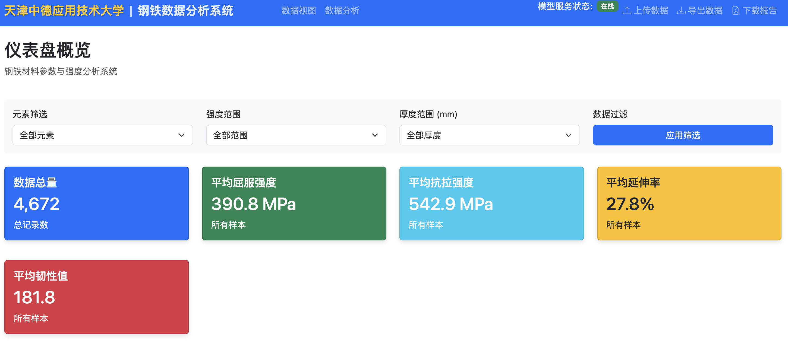
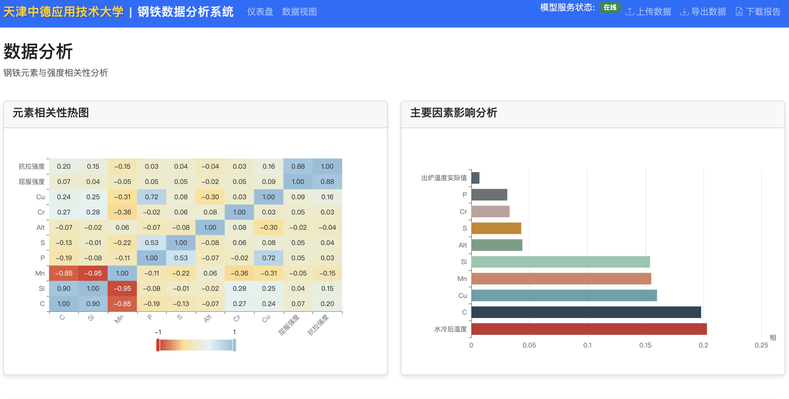
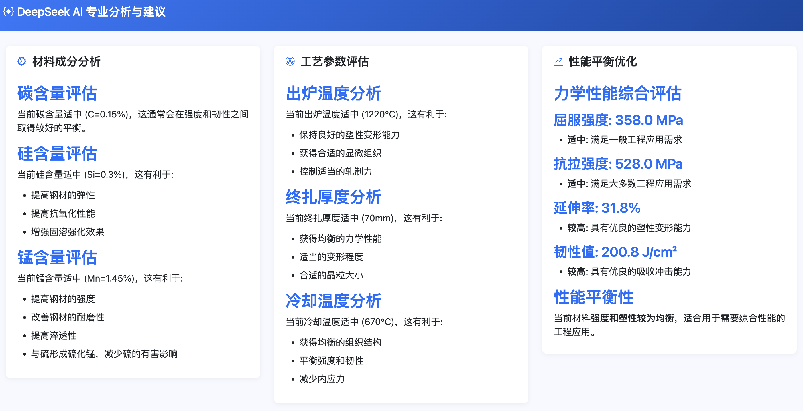
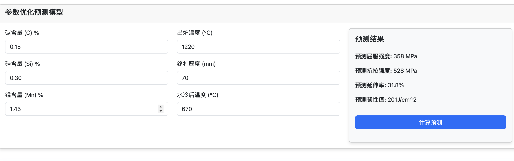

# 钢铁工业分析系统 🏭

[](https://www.python.org/)
[](https://reactjs.org/)
[](https://flask.palletsprojects.com/)
[](LICENSE)

> 基于机器学习的钢铁工业智能分析系统，助力钢材生产质量优化

## 📋 项目概述



本系统利用钢材的化学成分和工艺参数数据，通过机器学习模型进行分析和预测，帮助用户优化钢材生产过程，提高产品质量。系统支持单条数据预测和批量数据处理，并提供数据可视化分析功能。

## 🖥️ 系统界面展示







## ✨ 主要功能

- 🎯 **钢材性能预测**
  - 基于化学成分和工艺参数预测钢材的机械性能
  - 支持单条数据预测和批量数据处理

- 📊 **数据分析**
  - 趋势分析
  - 相关性分析
  - 散点分析
  - 多种数据可视化功能

- 📁 **批量处理**
  - CSV文件批量上传
  - 批量预测功能
  - 结果导出

- 🤖 **模型管理**
  - 模型状态监控
  - 特征分析
  - 模型训练与更新

## 🛠️ 技术栈

### 前端
- React 18
- Ant Design
- ECharts
- Webpack

### 后端
- Flask
- SQLite
- RESTful API

### 机器学习
- 随机森林
- XGBoost
- Pandas
- NumPy

### 测试
- Jest
- React Testing Library
- Cypress
- Python单元测试

## 🏗️ 系统架构

```
├── 前端 (UI/)
│   ├── 页面组件 (src/pages/)
│   ├── 通用组件 (src/components/)
│   ├── 服务 (src/services/)
│   └── 工具 (src/utils/)
│
├── 后端 (server.py)
│   ├── API接口
│   ├── 数据库管理
│   └── 模型管理
│
└── 机器学习模型
    ├── 屈服强度模型
    ├── 抗拉强度模型
    ├── 伸长率模型
    └── 韧性模型
```

## 🚀 快速开始

### 前提条件

- Node.js 18.x 或更高版本
- Python 3.8 或更高版本
- pip 包管理器
- 操作系统：Windows, macOS 或 Linux

### 安装步骤

1. 克隆仓库
   ```bash
   git clone [仓库地址]
   cd 钢铁工业分析系统
   ```

2. 安装后端依赖
   ```bash
   pip install -r requirements.txt
   ```

3. 安装前端依赖
   ```bash
   cd UI
   npm install
   ```

### 启动系统

1. 启动后端服务
   ```bash
   python server.py
   ```
   后端服务将在 http://localhost:9001 运行

2. 启动前端开发服务器
   ```bash
   cd UI
   npm start
   ```
   前端将在 http://localhost:9000 运行

### 登录系统

- 默认管理员账户：
  - 用户名：admin
  - 密码：admin123

## 📖 使用指南

### 钢材性能预测

1. **单条预测**
   - 进入"钢材性能预测"页面
   - 输入钢材的化学成分和工艺参数
   - 点击"开始预测"按钮

2. **批量预测**
   - 点击"批量预测"按钮
   - 上传CSV文件
   - 点击"开始批量预测"

### 数据分析

1. 进入"数据分析"页面
2. 选择性能指标和影响因子
3. 查看分析结果：
   - 趋势图
   - 相关性热力图
   - 散点图

### 模型管理（管理员功能）

1. 查看模型状态和性能
2. 分析特征重要性
3. 训练和更新模型

## 📁 文件结构

```
├── UI/                       # 前端代码
│   ├── src/                  # 源代码
│   │   ├── components/       # 通用组件
│   │   ├── pages/           # 页面组件
│   │   ├── services/        # API服务
│   │   └── utils/           # 工具函数
│   ├── public/              # 静态资源
│   ├── test/                # 测试文件
│   └── package.json         # 项目配置
│
├── 屈服强度/                  # 屈服强度模型
├── 抗拉强度/                  # 抗拉强度模型
├── 伸长率/                    # 伸长率模型
├── 韧性/                      # 韧性模型
│
├── server.py                # Flask后端服务
├── csv_processor.py         # CSV处理工具
├── requirements.txt         # Python依赖
└── steel_system.db          # SQLite数据库
```

## 🐛 常见问题

### CSV文件解析错误

**问题**：上传CSV文件时出现"Too few fields"错误

**解决方案**：
1. 确保CSV文件使用逗号作为分隔符
2. 检查文件编码是否为UTF-8
3. 使用修复工具：`python csv_processor.py`

### 模型加载失败

**问题**：系统无法加载机器学习模型

**解决方案**：
1. 检查模型文件是否存在
2. 确认模型文件格式正确
3. 重启后端服务

## 🤝 贡献指南

1. Fork 仓库
2. 创建功能分支 (`git checkout -b feature/amazing-feature`)
3. 提交更改 (`git commit -m 'Add some amazing feature'`)
4. 推送到分支 (`git push origin feature/amazing-feature`)
5. 创建Pull Request

## 📄 许可证

本项目采用 [MIT](LICENSE) 许可证

---

<div align="center">
  <sub>Built with ❤️ by Your Team</sub>
</div>


